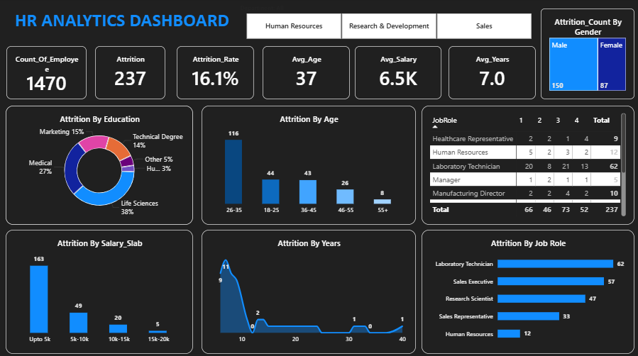

# HR Analytics Dashboard

## 📊 Overview
This HR Analytics Dashboard is developed using Power BI to analyze employee data and generate meaningful business insights.

The dashboard helps HR teams understand:
- Employee Attrition
- Salary Analysis
- Employee Count
- Job Satisfaction
- Department-wise Performance
- Gender Distribution

---

## 🛠️ Tools & Technologies
- Power BI
- Excel
- Data Cleaning
- DAX Functions

---

## 📁 Dataset Used
- HR Analysis Data.xlsx

---

## 📌 Dashboard Insights
✔ Total Employees Analysis  
✔ Attrition Rate Tracking  
✔ Average Salary Insights  
✔ Department-wise Employee Distribution  
✔ Gender Analysis  
✔ Employee Performance Monitoring  

---

## 🖼️ Dashboard Preview

---

## 🚀 Project Objective
The objective of this project is to help organizations make data-driven HR decisions using interactive visualizations and analytics.

---

## 👨‍💻 Created By
Somesh
